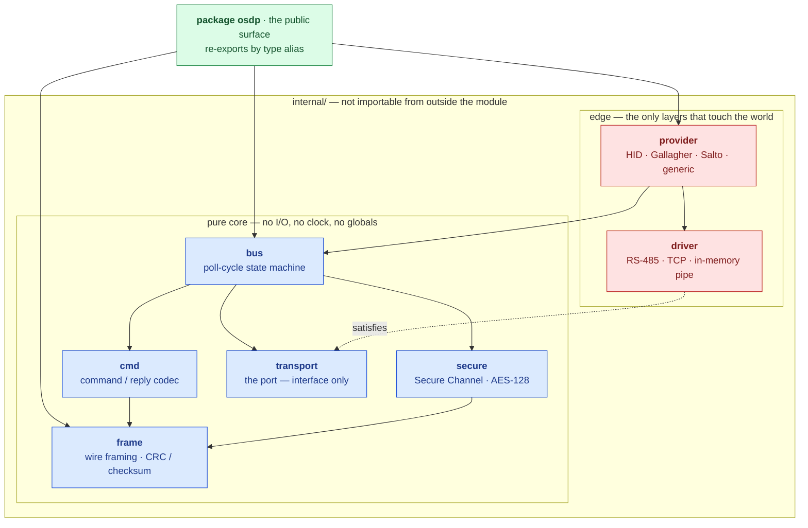
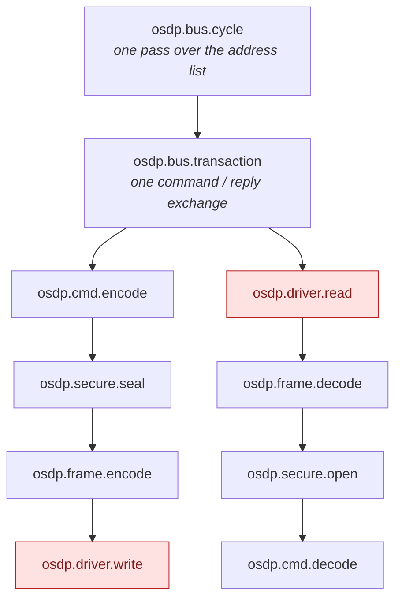
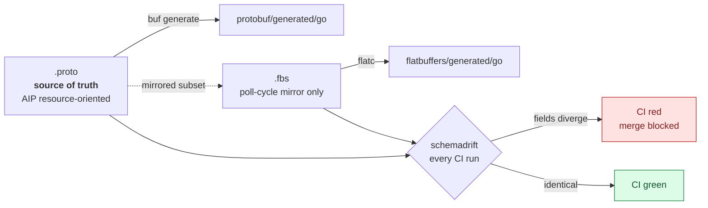
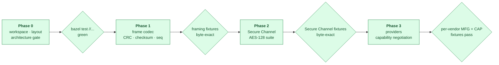

# osdp-go

A pure-Go implementation of the SIA OSDP v2.2.2 / IEC 60839-11-5 access-control
device protocol.

## Architecture

The stack is hexagonal. The core is a set of pure packages that compute over
their arguments and return decisions; only the two edge layers touch the outside
world.



Every solid arrow points inward. The one dotted arrow is the inversion that makes
the whole thing work: `bus` depends on the `transport` *interface*, and `driver`
satisfies it from outside. The core never learns whether it is speaking to an
RS-485 line, a socket, or a byte slice in a test.

Every protocol layer lives under `internal/`, so the public API is exactly what
`package osdp` chooses to re-export and the internals stay free to change.
Re-export is by **type alias**, not by wrapper type — an alias is the same type,
so a `Transport` implemented by a third party for a proprietary serial bridge,
or a `CipherSuite` registered beside the mandated AES-128 one, satisfies the
internal interfaces without this repository being involved. Wrapping instead of
aliasing would quietly close every extension point the architecture exists to
provide.

`telemetry` is omitted from the diagram because every layer may import it — it is
definitions and no-op tracers, with no direction of its own.

This is enforced, not merely documented. `internal/arch` asserts the permitted
import direction for every layer, fails any pure layer that reaches for the
network, the filesystem or a logger, and fails loudly if it cannot see the source
tree rather than passing on nothing. It runs under both `go test` and
`bazel test`.

```sh
just arch
```

### Vendor differences

Vendor support is a `Provider` on top of one shared codec. The differences
between an HID reader, a Gallagher reader and a Salto lock are confined to
`osdp_MFG` extension commands keyed by OUI, and to capability negotiation via
`osdp_CAP`. No vendor gets its own framing. If one appears to need it, that
belongs in `frame` as a quirk flag with a fixture proving it — vendor forks of
the wire format are how OSDP stacks rot.

Capability negotiation keeps what the device claimed separate from what the
panel ended up believing, because when a reader misbehaves in the field the
first question is which of the two was wrong:

```go
report, _ := osdp.ParseCapabilities(reply.Data) // the osdp_PDCAP reply, as sent
claimed := osdp.DeviceCapabilities(report)      // interpreted, still trusting
believed := registry.For(id).Reconcile(id, claimed)

if osdp.UsesDefaultKey(report) {
    // AES-128 capable, still on SCBK-D: installable, not yet confidential.
}
```

A report survives interpretation: unknown function codes are kept, re-encode
byte for byte, and stay readable through `report.Get` for an integrator holding
vendor documentation this library does not have.

### Secure Channel

The AES-128 suite mandated by the specification is **required** and always
registered: it is what every third-party reader in the field actually speaks, so
interoperability depends on it being reachable rather than merely compiled in.

A `CipherSuite` interface exists so a second suite can be registered *beside* the
standard one. It is an extension point, never a replacement, and the suite
registry test asserts exactly that.

### Observability

Spans sit at every layer boundary from the first commit. This is a design
constraint rather than an observability feature: a span wrapping `frame.Decode`
forces `Decode` to take a `context.Context`, which forces its callers to have
one, which is what keeps cancellation and deadlines flowing through a stack that
talks to hardware. Retrofitting it later means changing every signature in the
core.

The core depends on nothing to do it. `telemetry.Tracer` is three methods of
standard library, and attributes are declared as struct tags — inert strings
that cost a dependency-free core nothing:

```go
Address  Address `telemetry:"trace:osdp.device.address"`
Data     []byte  // no tag: a credential can never reach a trace
```

One call binds that seam to the
[telemetry-go](https://github.com/the-protobuf-project/telemetry) SDK, which
owns the OpenTelemetry integration:

```go
ctx = telemetry.ContextWithTracer(ctx, telemetry.Bind(p.Tracing.Start))
```

osdp-go never imports OpenTelemetry directly — a rule enforced by
`internal/arch/deps_test.go`, not merely documented.



The two red leaves are where real latency lives, which is precisely why the span
boundary sits there. Tracers resolve from the context, never from a
package-level global, so a consumer who configures nothing pays for a no-op.

## Schemas

`protobuf/` is the source of truth: a resource-oriented domain schema following
Google AIP, with standard methods and hierarchical resource names such as
`devices/{device}/events/{event}`. CI lints it against the AIP rules strictly,
with in-proto disable comments ignored.

`flatbuffers/` mirrors a deliberately small subset — the poll-cycle payloads
decoded thousands of times a minute, where allocation on the hot path matters.



Two schemas describing one thing invite drift, and drift here is not a compile
error but a field silently decoding at the wrong offset on a live bus. So a
mirrored table names its source message in the schema itself, where the two
cannot come apart:

```
/// mirrors: osdp.poll.v1.CardRead
table CardRead { ... }
```

and `just gen drift` verifies every declared pair on every CI run.

## Phases

Each phase ends with a fixture-corpus test: hex-dumped OSDP traffic decoded byte
for byte. A phase does not start until the previous one's corpus passes.



## Using it

```go
panel, device := osdp.Pipe() // or osdp.DialTCP(ctx, "converter:4001")
defer panel.Close()

line := osdp.Line{Name: "door-1", Baud: 9600, ReplyTimeout: time.Second}
bus := osdp.NewBus(line, []osdp.Address{0x00, 0x01}, osdp.SchemeCRC16)

step, _ := bus.Next(ctx)          // what to send, and how long to wait
wire, _ := step.Frame.Append(ctx, nil)
panel.Write(wire)

n, _ := panel.Read(buf)
reply, _ := osdp.Decode(ctx, buf[:n])
event, _ := bus.Reply(ctx, step.Device, reply, time.Now())

switch event.Kind {
case osdp.EventCardRead:  // event.Card is a credential; do not log it
case osdp.EventOffline:   // a reader stopped answering
}
```

The bus never touches the port. It says what should happen; when is the caller's
decision, which is what lets a full online/offline/resync scenario run as a
table test with no hardware.

## Development

```sh
just            # list every recipe
just build      # go build ./...
just test       # go test ./...
just arch       # architecture, purity and file-size conformance
just fixtures   # the phase gate: decode the hex corpus
just tidy       # regenerate BUILD files, tidy the module graph
just gen all    # protobuf + flatbuffers codegen, then the drift gate
```

Conventions that apply to every change — the 200-line file limit, documentation
requirements, and the library and runtime API rules — are in
[CLAUDE.md](CLAUDE.md).

Bazel 9 is bzlmod-only; there is no `WORKSPACE` file. The build is pure Go with
cgo disabled, which keeps cross-compilation to the ARM panels this runs on a
one-flag affair.
