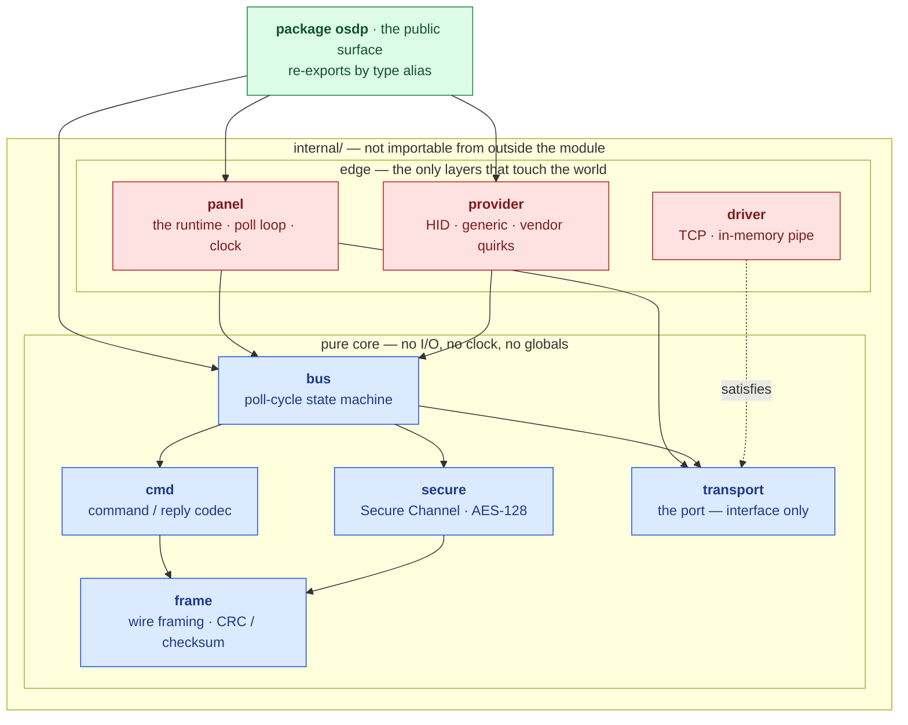

# osdp-go

A pure-Go SDK for SIA OSDP v2.2.2 / IEC 60839-11-5 — the protocol access-control
panels use to talk to card readers.

```sh
go get github.com/regalium-os/osdp-go
```

No dependencies. No cgo. Builds for linux/arm, linux/arm64, linux/amd64,
windows/amd64 and darwin/arm64 on every CI run, because the panels this runs on
are ARM boxes in a cupboard.

## Which side are you writing?

OSDP is strictly master/slave, and the roles are the opposite way round from
what "client" and "server" usually suggest:

| Spec term | Also called | Speaks first | Client/server analogy |
| --- | --- | --- | --- |
| **ACU** | control panel, CP | always | the **client** — it initiates every exchange |
| **PD** | peripheral device, reader | never | the **server** — it only ever answers |

The reader is the server. It sits silent until polled, and even a card
presented at the door waits for the next poll to be reported. The panel — the
box in the cupboard everyone calls "the server" — is the client here, because
it is the only thing on the line allowed to open its mouth unprompted.

**This SDK writes the ACU side.** `osdp.NewPanel` gives you a runtime that
polls a line, enrols devices, and hands you events.

The PD side is not yet a runtime. The pieces are direction-agnostic and do
work — `Frame` carries `IsReply`, `cmd` encodes replies, and the Secure Channel
implements the device role in full — but there is no device-side state machine
to sequence them. See [Building a device](#building-a-device).

## The thirty-second version

```go
ctx, cancel := context.WithCancel(context.Background())
defer cancel()

port, err := osdp.DialTCP(ctx, "converter:4001") // or osdp.Pipe() for tests
if err != nil {
    return err
}

line := osdp.Line{Name: "door-1", Baud: 9600, ReplyTimeout: 200 * time.Millisecond}
bus := osdp.NewBus(line, []osdp.Address{0x00, 0x01}, osdp.SchemeCRC16)

panel := osdp.NewPanel(bus, port)
defer panel.Close()

go func() {
    for event := range panel.Events() { // closed when Run returns
        switch event.Kind {
        case osdp.EventCardRead:
            // event.Card is a credential. Do not log it.
        case osdp.EventOffline:
            // a reader stopped answering
        }
    }
}()

if err := panel.Run(ctx); err != nil { // nil when ctx is cancelled
    return err
}
```

`New` starts nothing, so a panel can be built, inspected and discarded without
an octet reaching a line. `Run` owns every goroutine it starts and none outlive
it. `Close` is idempotent and safe after a failed `Run`.

## Listening

Everything a device does arrives on one channel.

```go
for event := range panel.Events() {
    switch event.Kind {
    case osdp.EventCardRead:      // event.Card — a credential
    case osdp.EventKeypad:        // event.Keypad — frequently a PIN
    case osdp.EventStatusChange:  // event.Status — doors, tampers, outputs
    case osdp.EventNAK:           // event.NAK — the device refused a command
    case osdp.EventOnline:        // enrolled and answering
    case osdp.EventOffline:       // missed enough polls to be presumed gone
    case osdp.EventSecure:        // a secure channel is up
    case osdp.EventSecureFailed:  // it could not be, or it was torn down
    }
}
```

A device going offline is an **event, not an error**. On a bus of hundreds of
readers one being unreachable is information to act on, not a reason to stop
polling the other ninety-nine. `Run` returns an error only for conditions the
caller must fix.

**Backpressure is a decision.** A full event buffer stops the poll cycle rather
than dropping, because the event this library most often carries is a credential
presented at a door, and quietly forgetting that somebody badged in is not a
trade worth making. `WithEventBuffer` sizes the slack; a consumer that stops
reading stalls the line.

### Watching a door

A card reader that cannot tell you the door is standing open is a card reader,
not an access-control system. Devices report contact state in answer to an
ordinary poll, and the bus turns reports into *changes*:

```go
case osdp.EventStatusChange:
    for _, c := range event.Status {
        switch c.Kind {
        case osdp.StatusInput:  // door position, request-to-exit
        case osdp.StatusTamper: // the reader has been pulled off the wall
        case osdp.StatusPower:  // running on backup, and about to go quiet
        }
    }
```

A door shut for a week is not an event; reporting it as one buries the door that
just opened. So only transitions are reported — with one exception. The **first**
report from a device is returned whole, because a panel coming up to a door that
is already open has nothing to compare against.

## Acting

```go
strike, indicator := osdp.Unlock(0, 0, 0, 5*time.Second)
panel.Send(ctx, addr, strike)     // release the door
panel.Send(ctx, addr, indicator)  // and show green for the same five seconds
```

Both halves of a grant are **timed** rather than latched: a panel that dies
mid-grant leaves a locked door and a reader telling the truth about it.

`Send` returns when the runtime has accepted the command, not when the device
has acted on it. A line carries one exchange at a time, so delivery waits for
the cycle; blocking until then would make an application hostage to the slowest
reader on the bus. What actually happened arrives on the event stream, where a
refusal is an `EventNAK`.

It is safe from any goroutine while `Run` executes. That is the only way into
the bus from outside, and it is what lets the bus itself stay single-threaded.

| Builder | Command | |
| --- | --- | --- |
| `OutputCommand` | `osdp_OUT` | strikes, relays, aux outputs |
| `LEDCommand` | `osdp_LED` | reader indicators |
| `BuzzerCommand` | `osdp_BUZ` | audible annunciators |
| `TextCommand` | `osdp_TEXT` | reader displays |
| `…StatusCommand` | `osdp_ISTAT` etc. | ask for contact state now |

An unanswered command is **retried, not lost**. The bus holds it until the
device replies; a reply lost to noise puts it back at the front of that device's
queue. The retry repeats the sequence number rather than advancing it — which is
how OSDP marks a retransmission, so a device that already acted replays its
cached answer instead of opening a door twice.

## Secure Channel

Off until a key says otherwise. A panel that silently began encrypting would
strand every reader whose key the application had not yet loaded.

```go
bus := osdp.NewBus(line, addrs, osdp.SchemeCRC16,
    osdp.WithSecureChannel(osdp.AES128{}, keyring.Lookup, randomNonce))
```

A device is challenged only when it claims AES-128 in `osdp_CAP` **and**
`keyring.Lookup` returns a key for it. Anything else is polled in the clear
rather than sent a challenge it can only refuse, once per cycle, forever.

- A failed handshake reports `EventSecureFailed` and is not retried: a
  cryptogram mismatch means the reader does not hold the key.
- A MAC failure on an *established* session is treated differently — the key is
  already proven, so the line is the likelier culprit, and the session is torn
  down and rebuilt.
- Commands carrying a payload travel enciphered under SCS_17. A poll has nothing
  to encipher and uses SCS_15.

`RND.A` is injected rather than read from `crypto/rand` here, for the same
reason time is: the core computes and does not act. It is also what lets a whole
handshake replay deterministically in a test.

> **Commissioning.** `osdp_KEYSET` is not implemented, so a device cannot yet be
> moved off SCBK-D by this library. `osdp.DefaultBaseKey` will reach a
> factory-fresh reader; something else has to install the site key.

## Vendors

Vendor support is a `Provider` over one shared codec. The differences between an
HID reader, a Gallagher reader and a Salto lock are confined to `osdp_MFG`
extension messages keyed by OUI, and to capability negotiation — no vendor gets
its own framing.

```go
report, _ := osdp.ParseCapabilities(reply.Data) // the osdp_PDCAP reply, as sent
claimed := osdp.DeviceCapabilities(report)      // interpreted, still trusting
believed := registry.For(id).Reconcile(id, claimed)

if osdp.UsesDefaultKey(report) {
    // AES-128 capable, still on SCBK-D: installable, not yet confidential.
}
```

What the device claimed and what the panel believes are kept apart on purpose:
when a reader misbehaves in the field, the first question is which of the two was
wrong. Unknown capability codes survive interpretation and re-encode byte for
byte, so an integrator holding vendor documentation can read what this library
could not.

## Recording

`protobuf/record` converts a runtime event into the domain record of it. It is a
**separate module**, so the library itself stays dependency-free: the schema
module imports `osdp-go`, never the other way round.

```go
recs, err := record.FromEvent(event, name, observedAt)
```

**A credential is not recorded unless you ask.** By default a card read records
the reader, the format and the bit count — enough to say a 26-bit Wiegand
credential was presented at reader 0, not enough to say whose. A record leaves
the panel: over a network, into a database, into a backup, and into whatever
reads that backup in five years. `record.WithCredentials()` is the opt-in.

Each record carries whether the exchange was authenticated, because a credential
that arrived in the clear is different evidence from one that arrived over a
secure channel — and after the fact there is no way to tell them apart unless it
was written down at the time.

## What works

| | Status |
| --- | --- |
| Framing — CRC-16 / checksum, mark octets, security blocks | complete, byte-exact round trip |
| Poll cycle — enrolment, online/offline, resync, retransmission | complete |
| Secure Channel — handshake, authenticated and encrypted traffic | complete, **except key install** |
| Commands — output, LED, buzzer, text, status requests | complete |
| Events — card, keypad, status, NAK, vendor, lifecycle | complete |
| Capability negotiation and vendor quirks | complete |
| Transports — TCP, in-memory pipe | **no serial/RS-485 driver yet** |
| `osdp_KEYSET` — move a device off the default key | not implemented |
| `osdp_COMSET` — change baud rate or address | not implemented |
| `osdp_BUSY` — a device asking you to retry | **read as success; known bug** |
| File transfer, biometrics, PIV | not implemented |
| Peripheral-device (reader) runtime | not implemented |

### Building a device

There is no PD runtime, but nothing in the codec prevents one. `frame` encodes
and decodes both directions, `cmd` builds replies as readily as commands, and
`secure` implements `RolePD` in full — the handshake tests drive a real device
session against a real panel session. What is missing is the sequencing: reply
caching per sequence number, and the state machine that decides what a device
says when. The test suite contains a working peripheral for exactly this reason;
it is a starting point rather than a product.

## Architecture

The stack is hexagonal. The core computes over its arguments and returns
decisions; only the edge layers touch the world.



Every solid arrow points inward. The dotted one is the inversion that makes it
work: `bus` depends on the `transport` *interface*, and `driver` satisfies it
from outside, so the core never learns whether it is speaking to a socket or a
byte slice in a test.

`panel` is the one component that acts — it owns the port, waits on the clock,
and turns decisions into traffic. There is exactly one place in this library
that can block, which is worth knowing when a line goes quiet.

Re-export is by **type alias**, not wrapper. An alias is the same type, so a
`Port` written by a third party for a proprietary serial bridge, or a
`CipherSuite` registered beside the mandated AES-128 one, satisfies the internal
interfaces without this repository being involved.

This is enforced rather than documented. `internal/arch` asserts the permitted
import direction for every layer, fails any pure layer that reaches for the
network or the clock, fails a file that outgrows 200 lines, fails a source file
with no licence notice, and fails loudly if it cannot see the source tree rather
than passing on nothing.

```sh
just arch
```

### Observability

Spans sit at every layer boundary. That is a design constraint rather than a
feature: a span wrapping `frame.Decode` forces it to take a `context.Context`,
which forces its callers to have one, which is what keeps cancellation flowing
through a stack that talks to hardware.

The core depends on nothing to do it. Attributes are declared as struct tags —
inert strings that cost a dependency-free core nothing:

```go
Address  Address `telemetry:"trace:osdp.device.address"`
Data     []byte  // no tag: a credential can never reach a trace
```

**An untagged field is never recorded, and that is the safety mechanism.** One
call binds the seam to the [telemetry-go][t] SDK, which owns the OpenTelemetry
integration; osdp-go never imports OpenTelemetry directly.

[t]: https://github.com/the-protobuf-project/telemetry

```go
ctx = telemetry.ContextWithTracer(ctx, telemetry.Bind(p.Tracing.Start))
```

## Schemas

`protobuf/` is the source of truth: resource-oriented per Google AIP, with
hierarchical names like `devices/{device}/events/{event}`.
`protobuf/generated/flatbuffers/` mirrors a deliberately small subset — the
poll-cycle payloads decoded thousands of times a minute — generated from the
same descriptor set, never hand-written.

Two schemas describing one thing invite drift, and drift here is not a compile
error but a field silently decoding at the wrong offset on a live bus. So
`just gen drift` checks **three** artefacts against each other: the `.proto`
says what a field is and which number it holds, `buffers.lock` says which target
ordinal that number was committed to, and the `.fbs` says where the mirror put
it. Any two agreeing while the third differs tells you which one moved.

The gate fails when it finds no schemas at all. A check that reports success
because it could not find what it was meant to inspect is worse than no check,
because it is believed.

## Development

```sh
just            # list every recipe
just build      # every module in the workspace
just test       # every module in the workspace
just arch       # architecture, purity, file size, licence conformance
just race       # the suite under the race detector
just lint       # golangci-lint, as CI runs it
just gen all    # codegen, then the drift gate
just tidy       # regenerate BUILD files
```

Conventions that apply to every change — the 200-line file limit, documentation
requirements, and the library and runtime API rules — are in
[CLAUDE.md](CLAUDE.md).

## Licence

Apache 2.0. See [LICENSE](LICENSE). Every source file carries the notice and its
SPDX identifier, and `internal/arch/license_test.go` fails the build for one
that does not.
