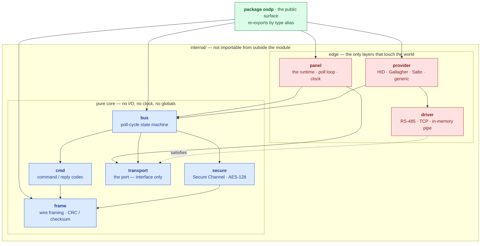
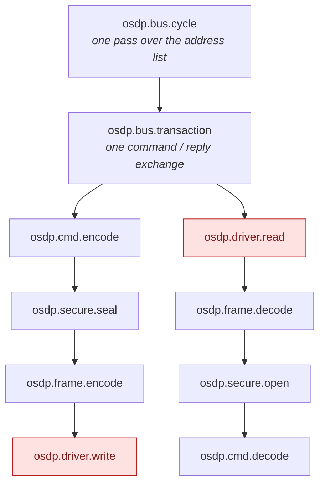
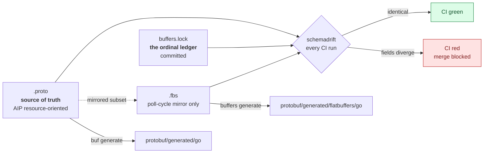

# osdp-go

A pure-Go implementation of the SIA OSDP v2.2.2 / IEC 60839-11-5 access-control
device protocol.

## Architecture

The stack is hexagonal. The core is a set of pure packages that compute over
their arguments and return decisions; only the two edge layers touch the outside
world.



Every solid arrow points inward. The one dotted arrow is the inversion that makes
the whole thing work: `bus` depends on the `transport` *interface*, and `driver`
satisfies it from outside. The core never learns whether it is speaking to an
RS-485 line, a socket, or a byte slice in a test.

Every protocol layer lives under `internal/`, so the public API is exactly what
`package osdp` chooses to re-export and the internals stay free to change.
Re-export is by **type alias**, not by wrapper type — an alias is the same type,
so a `Transport` implemented by a third party for a proprietary serial bridge,
or a `CipherSuite` registered beside the mandated AES-128 one, satisfies the
internal interfaces without this repository being involved. Wrapping instead of
aliasing would quietly close every extension point the architecture exists to
provide.

`telemetry` is omitted from the diagram because every layer may import it — it is
definitions and no-op tracers, with no direction of its own.

This is enforced, not merely documented. `internal/arch` asserts the permitted
import direction for every layer, fails any pure layer that reaches for the
network, the filesystem or a logger, and fails loudly if it cannot see the source
tree rather than passing on nothing. It runs under both `go test` and
`bazel test`.

```sh
just arch
```

### Vendor differences

Vendor support is a `Provider` on top of one shared codec. The differences
between an HID reader, a Gallagher reader and a Salto lock are confined to
`osdp_MFG` extension commands keyed by OUI, and to capability negotiation via
`osdp_CAP`. No vendor gets its own framing. If one appears to need it, that
belongs in `frame` as a quirk flag with a fixture proving it — vendor forks of
the wire format are how OSDP stacks rot.

Capability negotiation keeps what the device claimed separate from what the
panel ended up believing, because when a reader misbehaves in the field the
first question is which of the two was wrong:

```go
report, _ := osdp.ParseCapabilities(reply.Data) // the osdp_PDCAP reply, as sent
claimed := osdp.DeviceCapabilities(report)      // interpreted, still trusting
believed := registry.For(id).Reconcile(id, claimed)

if osdp.UsesDefaultKey(report) {
    // AES-128 capable, still on SCBK-D: installable, not yet confidential.
}
```

A report survives interpretation: unknown function codes are kept, re-encode
byte for byte, and stay readable through `report.Get` for an integrator holding
vendor documentation this library does not have.

### Secure Channel

The AES-128 suite mandated by the specification is **required** and always
registered: it is what every third-party reader in the field actually speaks, so
interoperability depends on it being reachable rather than merely compiled in.

A `CipherSuite` interface exists so a second suite can be registered *beside* the
standard one. It is an extension point, never a replacement, and the suite
registry test asserts exactly that.

The bus brings the channel up from what the device itself said it could do, and
is off until a key says otherwise — a panel that silently began encrypting would
strand every reader whose key the application had not yet loaded:

```go
bus := osdp.NewBus(line, addrs, osdp.SchemeCRC16,
    osdp.WithSecureChannel(osdp.AES128{}, keyring.Lookup, randomNonce))
```

A device is challenged only when it claims AES-128 **and** `keyring.Lookup`
returns a key for it. Anything else is polled in the clear rather than being
sent a challenge it can only refuse, once per cycle, forever. A device that
fails the handshake reports `EventSecureFailed` and is not asked again: a
cryptogram mismatch means the reader does not hold the key, and retrying cannot
change that. A frame that fails its MAC on an *established* session is treated
differently — the key is already proven, so the line is the likelier culprit,
and the session is torn down and rebuilt.

`RND.A` is injected rather than read from `crypto/rand` here, for the same
reason time is: the core computes and does not act. It is also what lets a whole
handshake replay deterministically in a table test.

### Observability

Spans sit at every layer boundary from the first commit. This is a design
constraint rather than an observability feature: a span wrapping `frame.Decode`
forces `Decode` to take a `context.Context`, which forces its callers to have
one, which is what keeps cancellation and deadlines flowing through a stack that
talks to hardware. Retrofitting it later means changing every signature in the
core.

The core depends on nothing to do it. `telemetry.Tracer` is three methods of
standard library, and attributes are declared as struct tags — inert strings
that cost a dependency-free core nothing:

```go
Address  Address `telemetry:"trace:osdp.device.address"`
Data     []byte  // no tag: a credential can never reach a trace
```

One call binds that seam to the
[telemetry-go](https://github.com/the-protobuf-project/telemetry) SDK, which
owns the OpenTelemetry integration:

```go
ctx = telemetry.ContextWithTracer(ctx, telemetry.Bind(p.Tracing.Start))
```

osdp-go never imports OpenTelemetry directly — a rule enforced by
`internal/arch/deps_test.go`, not merely documented.



The two red leaves are where real latency lives, which is precisely why the span
boundary sits there. Tracers resolve from the context, never from a
package-level global, so a consumer who configures nothing pays for a no-op.

## Schemas

`protobuf/` is the source of truth: a resource-oriented domain schema following
Google AIP, with standard methods and hierarchical resource names such as
`devices/{device}/events/{event}`. CI lints it against the AIP rules strictly,
with in-proto disable comments ignored.

`protobuf/generated/flatbuffers/` mirrors a deliberately small subset — the
poll-cycle payloads decoded thousands of times a minute, where allocation on the
hot path matters. It is generated from the same descriptor set as the Go types,
so nobody maintains a second copy by hand.



Two schemas describing one thing invite drift, and drift here is not a compile
error but a field silently decoding at the wrong offset on a live bus. So a
mirrored schema names its source in the file itself, where the two cannot come
apart — the generator writes the declaration:

```
// source: osdp/event/v1/payloads.proto
namespace osdp.event.v1;
```

`just gen drift` then checks **three** artefacts against each other, not two.
The `.proto` says what a field is and which number it holds. `buffers.lock` —
the committed ordinal ledger — says which target slot that number was given.
The `.fbs` says where the mirror actually put it. Any two agreeing while the
third differs is the interesting case, because it says which one moved.

The gate fails when it finds no schemas at all. A check that reports success
because it could not find what it was meant to inspect is worse than no check,
because it is believed.

### Recording what happened

`protobuf/record` turns a runtime event into the domain record of it. It lives
in the schema module rather than the library, and the direction is what makes
that work: the schema module imports `osdp-go`, and `osdp-go` imports nothing.
An application that wants protobuf records opts into that module and pays for
it; one that only drives a bus does not, and `internal/arch` fails the build if
a core layer ever reaches for the generated types.

```go
rec, err := record.FromEvent(event, name, observedAt)
```

**A credential is not recorded unless you ask.** By default a card read records
the reader, the format and the bit count — enough to say a 26-bit Wiegand
credential was presented at reader 0, not enough to say whose. A record leaves
the panel: over a network, into a database, into a backup, and into whatever
reads that backup in five years. `record.WithCredentials()` includes the number,
for the systems that genuinely need it, as a decision somebody made rather than
a default nobody noticed.

Each record also carries whether the exchange was authenticated, because a
credential that arrived in the clear is different evidence from one that arrived
over a secure channel — and after the fact there is no way to tell them apart
unless it was written down at the time.

## The runtime

Everything under `internal/` computes: it takes arguments and returns a decision.
`panel` is the one component that acts. It owns the port, waits on the clock,
and turns the bus's decisions into traffic — which means there is exactly one
place in this library that can block, worth knowing when a line goes quiet.

```go
p := osdp.NewPanel(bus, port)
defer p.Close()

go func() {
    for event := range p.Events() {  // Run closes this channel as it returns
        switch event.Kind {
        case osdp.EventCardRead: // event.Card is a credential; do not log it
        case osdp.EventOffline:  // a reader stopped answering
        }
    }
}()

err := p.Run(ctx) // nil when ctx is cancelled
```

`New` starts nothing, so a panel can be built, inspected and discarded without a
single octet reaching a line. `Run` owns everything it starts and nothing
outlives it. `Close` is idempotent and safe after a failed `Run`.

### Watching a door

A card reader that cannot tell you the door is standing open is a card reader,
not an access-control system. Devices report contact state in answer to an
ordinary poll, and the bus turns reports into **changes**:

```go
case osdp.EventStatusChange:
    for _, c := range event.Status {
        switch c.Kind {
        case osdp.StatusInput:  // door position, request-to-exit
        case osdp.StatusTamper: // the reader has been pulled off the wall
        case osdp.StatusPower:  // running on backup, and about to go quiet
        }
    }
```

A door that has been shut for a week is not an event; reporting it as one buries
the door that just opened. So only transitions are reported — with one
exception. The **first** report from a device is returned whole, because a panel
coming up to a door that is already standing open has nothing to compare
against, and a contact that was abnormal at boot would otherwise stay invisible
until somebody closed it.

### Acting on a device

Polling is only half a panel. `Send` queues a command for the next time the
cycle reaches that address:

```go
strike, indicator := osdp.Unlock(0, 0, 0, 5*time.Second)
p.Send(ctx, addr, strike)     // release the door
p.Send(ctx, addr, indicator)  // and show green for the same five seconds
```

It returns when the runtime has accepted the command, not when the device has
acted on it — a line carries one exchange at a time, so delivery waits for the
cycle, and blocking until then would make an application hostage to the slowest
reader on the bus. What actually happened arrives on the event stream, where a
refusal is an `EventNAK`.

A reader with a display is written the same way:

```go
p.Send(ctx, addr, osdp.TextCommand(osdp.TextDisplay{Content: "DOOR SECURE"}))
```

Two details of `osdp_TEXT` are worth knowing before you hit them. Its `Row` and
`Column` are numbered **from one** — a zero is sent as one, so the zero value
lands at the top-left rather than nowhere. And its hold time is in **whole
seconds**, where `osdp_LED` and `osdp_BUZ` count in hundreds of milliseconds;
that inconsistency is the specification's, and the field is documented rather
than smoothed over.

Both halves of a grant are **timed** rather than latched. A panel that dies
mid-grant leaves a locked door and a reader showing the truth about it, which is
the behaviour a door should have when its panel stops talking.

`Send` is safe from any goroutine while `Run` executes. That is the only way
into the bus from outside, and it is what lets the bus stay single-threaded: the
request crosses to the run loop, which is the one goroutine that ever touches it.

Over a Secure Channel a command carrying a payload travels under **SCS_17**,
enciphered — an osdp_POLL has nothing to encipher and uses SCS_15, but a door
release does, and it must not be readable by anyone who can reach the wire.

**Backpressure is a decision, not an accident.** A full event buffer stops the
poll cycle rather than dropping events, because the event this library most
often carries is a credential presented at a door, and quietly forgetting that
somebody badged in is not a trade worth making. `WithEventBuffer` sizes the
slack; a consumer that stops reading altogether stalls the line.

Cancellation is observed between transactions and while publishing, both
immediately — but never inside a blocked read or write, because no context
interrupts a blocked syscall. Those are bounded by the line's `ReplyTimeout`
instead, so shutdown takes up to one reply timeout rather than none.

## Phases

Each phase ends with a fixture-corpus test: hex-dumped OSDP traffic decoded byte
for byte. A phase does not start until the previous one's corpus passes.

```mermaid
flowchart LR
    p0["<b>Phase 0</b><br/>workspace · layout<br/>architecture gate"]
    g0{"bazel test //...<br/>green"}
    p1["<b>Phase 1</b><br/>frame codec<br/>CRC · checksum · seq"]
    g1{"framing fixtures<br/>byte-exact"}
    p2["<b>Phase 2</b><br/>Secure Channel<br/>AES-128 suite"]
    g2{"Secure Channel fixtures<br/>byte-exact"}
    p3["<b>Phase 3</b><br/>providers<br/>capability negotiation"]
    g3{"per-vendor MFG + CAP<br/>fixtures pass"}
    p4["<b>Phase 4</b><br/>Secure Channel<br/>on the poll cycle"]
    g4{"handshake + authenticated<br/>traffic, both ends"}
    p5["<b>Phase 5</b><br/>the runtime<br/>poll loop · lifecycle"]
    g5{"enrolment, offline and<br/>shutdown over a real port"}
    p6["<b>Phase 6</b><br/>commands<br/>output · LED · buzzer"]
    g6{"a door opens, and<br/>enciphered when secure"}

    p0 --> g0 --> p1 --> g1 --> p2 --> g2 --> p3 --> g3 --> p4 --> g4 --> p5 --> g5 --> p6 --> g6

    classDef done fill:#dcfce7,stroke:#15803d,color:#14532d
    class p0,g0,p1,g1,p2,g2,p3,g3,p4,g4,p5,g5,p6,g6 done
```



## Using it

```go
panel, device := osdp.Pipe() // or osdp.DialTCP(ctx, "converter:4001")
defer panel.Close()

line := osdp.Line{Name: "door-1", Baud: 9600, ReplyTimeout: time.Second}
bus := osdp.NewBus(line, []osdp.Address{0x00, 0x01}, osdp.SchemeCRC16)

step, _ := bus.Next(ctx)          // what to send, and how long to wait
wire, _ := step.Frame.Append(ctx, nil)
panel.Write(wire)

n, _ := panel.Read(buf)
reply, _ := osdp.Decode(ctx, buf[:n])
event, _ := bus.Reply(ctx, step.Device, reply, time.Now())

switch event.Kind {
case osdp.EventCardRead:  // event.Card is a credential; do not log it
case osdp.EventOffline:   // a reader stopped answering
case osdp.EventSecure:    // event.DefaultKey means it is still on SCBK-D
}
```

The bus never touches the port. It says what should happen; when is the caller's
decision, which is what lets a full online/offline/resync scenario run as a
table test with no hardware.

## Development

```sh
just            # list every recipe
just build      # go build ./...
just test       # go test ./...
just arch       # architecture, purity and file-size conformance
just fixtures   # the phase gate: decode the hex corpus
just tidy       # regenerate BUILD files, tidy the module graph
just gen all    # protobuf + flatbuffers codegen, then the drift gate
```

Conventions that apply to every change — the 200-line file limit, documentation
requirements, and the library and runtime API rules — are in
[CLAUDE.md](CLAUDE.md).

Bazel 9 is bzlmod-only; there is no `WORKSPACE` file. The build is pure Go with
cgo disabled, which keeps cross-compilation to the ARM panels this runs on a
one-flag affair.

## Licence

Apache License 2.0. See [LICENSE](LICENSE).

Every source file carries the notice and its SPDX identifier:

```go
// Copyright 2026 RegaliumOS™.
// SPDX-License-Identifier: Apache-2.0
```

The machine-readable identifier is the part that matters: a compliance scan in
the software that imports this library reads that line, not the prose in
LICENSE. `internal/arch/license_test.go` fails the build for a source file
without one, so the notice cannot rot as files are added.

Generated output under `protobuf/generated/` is excluded, because it is
rewritten wholesale on every run. The notice lives on the `.proto` it is
generated from instead, and `protoc-gen-go` carries that leading comment block
into the Go it emits.
